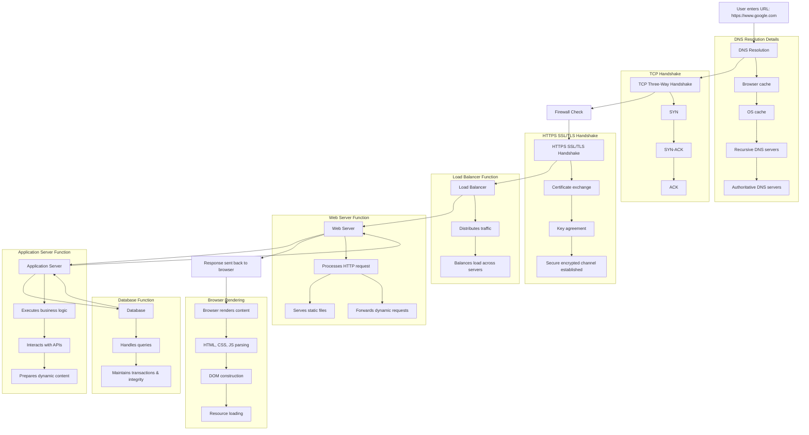

# What Happens When...

This flowchart explains the detailed steps of what happens when you type a URL like `https://www.google.com` into your browser and press Enter.

```mermaid
flowchart TD
    A[User enters URL: https://www.google.com] --> B[DNS Resolution]
    B --> C[TCP Three-Way Handshake]
    C --> D[Firewall Check]
    D --> E[HTTPS SSL/TLS Handshake]
    E --> F[Load Balancer]
    F --> G[Web Server]
    G --> H[Application Server]
    H --> I[Database]
    I --> H
    H --> G
    G --> J[Response sent back to browser]
    J --> K[Browser renders content]

    subgraph DNS Resolution Details
        B1[Browser cache]
        B2[OS cache]
        B3[Recursive DNS servers]
        B4[Authoritative DNS servers]
        B --> B1 --> B2 --> B3 --> B4
    end

    subgraph TCP Handshake
        C1[SYN]
        C2[SYN-ACK]
        C3[ACK]
        C --> C1 --> C2 --> C3
    end

    subgraph HTTPS SSL/TLS Handshake
        E1[Certificate exchange]
        E2[Key agreement]
        E3[Secure encrypted channel established]
        E --> E1 --> E2 --> E3
    end

    subgraph Load Balancer Function
        F1[Distributes traffic]
        F2[Balances load across servers]
        F --> F1 --> F2
    end

    subgraph Web Server Function
        G1[Processes HTTP request]
        G2[Serves static files]
        G3[Forwards dynamic requests]
        G --> G1 --> G2
        G1 --> G3
    end

    subgraph Application Server Function
        H1[Executes business logic]
        H2[Interacts with APIs]
        H3[Prepares dynamic content]
        H --> H1 --> H2 --> H3
    end

    subgraph Database Function
        I1[Handles queries]
        I2[Maintains transactions & integrity]
        I --> I1 --> I2
    end

    subgraph Browser Rendering
        K1[HTML, CSS, JS parsing]
        K2[DOM construction]
        K3[Resource loading]
        K --> K1 --> K2 --> K3
    end
```